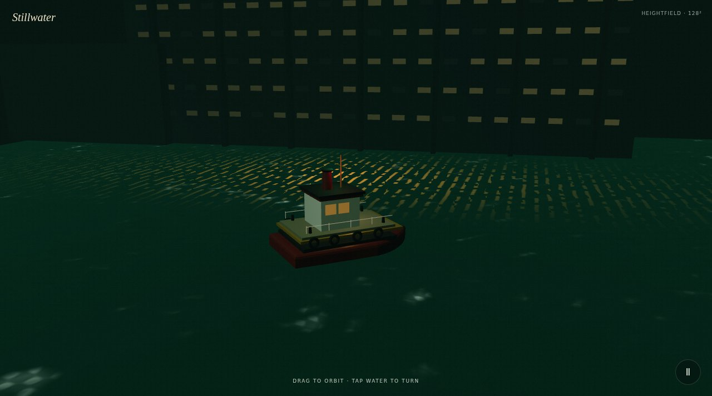

# Stillwater

A real-time night harbor.



**Live:** https://aeiouvcode.github.io/stillwater-harbor/

## About

A 128x128 heightfield wave simulation with foam wake behind a moving boat and broken reflections of harbor lights. Drag to orbit, tap the water to turn the boat.

## Built with

Three.js r168 (ES module from jsDelivr) and custom water shaders in one `index.html`.

## Run locally

```sh
git clone https://github.com/aeiouvcode/stillwater-harbor.git
cd stillwater-harbor
python3 -m http.server 8000
```

Then open http://localhost:8000.

An internet connection is needed on first load for the Three.js module.
